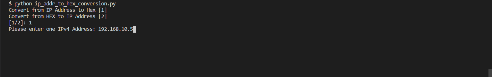

# Convert IPv4 Address to HEX IP and vice versa

This program is designed to convert an IPv4 Address to a HEX IP and vice versa.

> This program is useful for **Wireless** and **Collaboration** teams where they use the HEX IPs in DHCP pools;

**Example:**

```bash
ip dhcp pool APs
   network <SUBNET> <NETMASK>
   default-router <IP_ADDR>
   dns-server <PRIMARY_DNS_IP> <SECONDARY_DNS_IP>
   option 43 hex f104.c0a8.0a05
exit
```

## Table of Contents

1. [Installation](#installation)
2. [Getting Started](#getting-started)
3. [Usage](#usage)
   1. [IP to HEX](#ip-to-hex)
   2. [HEX to IP](#hex-to-ip)

### Installation

```bash
$ git clone https://github.com/Tes3awy/HEX-to-IP-Conversion.git
$ cd HEX-to-IP-Conversion
$ pip install -r requirements.txt
```

### Getting Started

```bash
│   main.py
│   ip_to_hex.py
│   hex_to_ip.py
│   requirements.txt
│   README.md
│   .gitignore
│   LICENSE
│
└───assets
      1.png
      2.png
      3.png
      4.png
```

### Usage

```python3
python main.py
```

You will get prompted to enter one of two values: `[1/2]`.

> 1 is to convert from IPv4 to HEX

> 2 is to convert from HEX to IPv4

#### IP to HEX




#### HEX to IP


